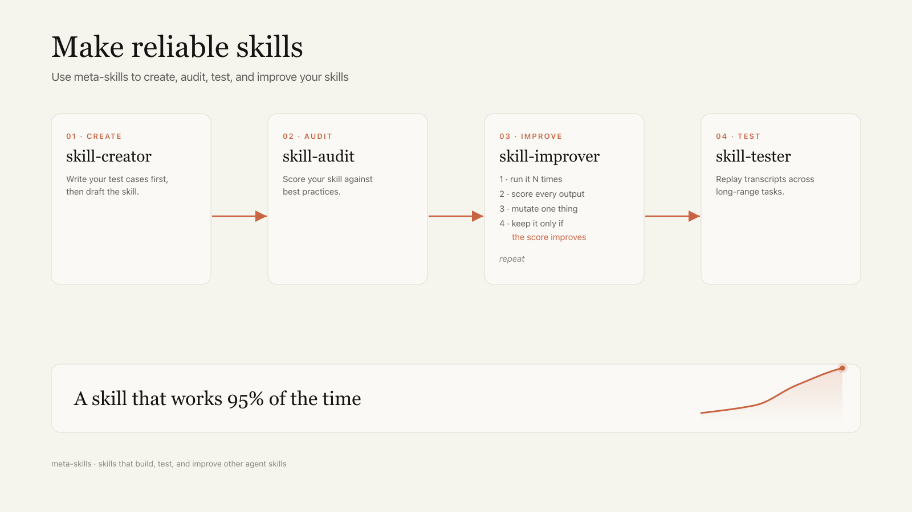

# meta-skills


**Skills that build, test, and improve other agent skills.**

Most agent skills are written once and never measured. They work maybe 70% of the time, and the other 30% you get garbage you only notice in production. This is a small toolkit for treating skills like software you can actually engineer: draft them, audit them against a checklist, then run them dozens of times against real evals and keep only the changes that measurably help.

These are [agent skills](https://platform.claude.com/docs/en/agents-and-tools/agent-skills/overview) to teach your AI agents how to make skills based pn best practices. They work with [Claude Code](https://docs.anthropic.com/en/docs/claude-code), [Hermes Agent](https://github.com/NousResearch/hermes-agent), Codex, and other skill-aware agents.

The seven core skills cover the whole lifecycle of a skill, from first draft to measured reliability (plus a memory toolkit below so your agent remembers across runs):



## The skills

| Skill | What it does |
|-------|--------------|
| **[skill-creator](skill-creator/)** | Create a new skill from scratch or improve an existing one. Enforces a test-first workflow: write 3+ pressure scenarios that fail *without* the skill before you write a line of the skill itself. Includes an eval viewer to inspect runs. |
| **[skill-audit](skill-audit/)** | Score any skill against a structured checklist of gotchas. Outputs a scorecard with specific fixes. The fast first pass before you spend tokens optimizing. |
| **[skill-tester](skill-tester/)** | Test an interactive skill by *running* it, not reviewing it. An agent plays both the AI agent and a user persona, capturing a full turn-by-turn transcript, then publishes them all raw to one static page. Shows you exactly where it breaks. |
| **[skill-improver](skill-improver/)** | Improve your skill systematically by using ML techniques to hill climb on your evaluation test cases. |
| **[optimize-prompt](optimize-prompt/)** | The lightweight version: tune a single system prompt with one-change-at-a-time experiments. One artifact, one metric, keep what improves it, revert what doesn't. No harness required. |

## Memory

A skill is only as good as what the agent remembers between runs. These three give any skill-aware agent a persistent, self-maintaining memory built on plain dated markdown files, no vector database required.

| Skill | What it does |
|-------|--------------|
| **[memory-setup](memory-setup/)** | Stand up persistent memory for any agent from scratch: the workspace files, the `[YYYY-MM-DD][tag]` entry format, session-end extraction, daily garbage collection, multi-tier recall, and optional vector search. Agent-agnostic. |
| **[memory-gc](memory-gc/)** | The nightly maintenance pass. Decays entries by age, drains the spillover queue, collapses near-duplicates and project-namespace sprawl, relocates project facts to topic files, and holds hot memory under a size target. Ships a deterministic pre-prune script. |
| **[recall](recall/)** | Answer "when did we…?" questions by walking storage cheapest-first (hot memory, then topic files, then dated episodes, then raw transcripts) and stopping as soon as more searching stops improving the answer. Includes an anti-hallucination pattern so the agent never invents history. |

## Why eval-driven

The core idea across `skill-improver` and `optimize-prompt`: **the fix for an unreliable skill isn't rewriting it from intuition, it's measurement.**

1. Turn "good output" into specific evaluation criteria. Not "is this engaging?" (ungameable, subjective) but "does the first sentence contain a specific claim, not a generic statement?" (observable).
2. Split your test inputs into train / validation / test so you can't fool yourself by overfitting.
3. Change one thing. Re-run. Keep it only if the held-out score goes up. Log every rejected edit.
4. Stop when it plateaus, then score the sealed test set once.

The recurring lesson baked into these skills: **more rules usually make a skill worse.** The optimizer's instinct is to append instructions when evals fail. That crowds out the core loop and tanks validation. Subtraction beats addition more often than you'd think.

## Using a skill

Point any skill-aware agent at this repo and ask it to load the skill, or copy a skill folder into your agent's skills directory. Each skill is self-contained: a `SKILL.md` entry point plus `references/` and `scripts/` it loads as needed.

```bash
git clone https://github.com/exiao/meta-skills
# then, in your agent:
#   "use skill-creator to build me a skill for X"
#   "audit skills/my-skill against best practices"
#   "optimize my-skill: here are 10 test inputs and 4 binary evals"
```

## Credits

- `skill-creator` is adapted from Anthropic's internal skill-creation tooling.
- `skill-improver` builds on Karpathy's autoresearch pattern, [SkillOpt](https://arxiv.org/abs/2605.23904) (Microsoft Research), and the eval-writing practices from [howtoeval.com](https://www.howtoeval.com).

## License

Apache 2.0. See [LICENSE.txt](LICENSE.txt).
